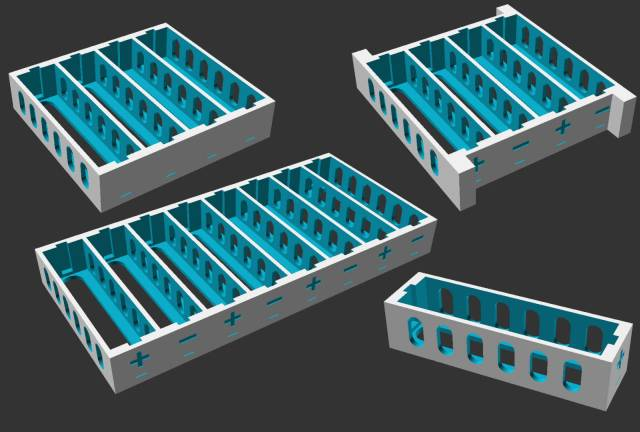
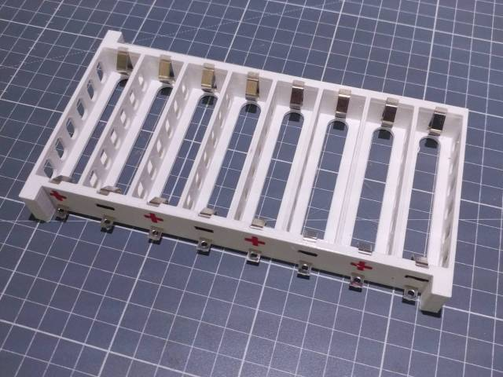
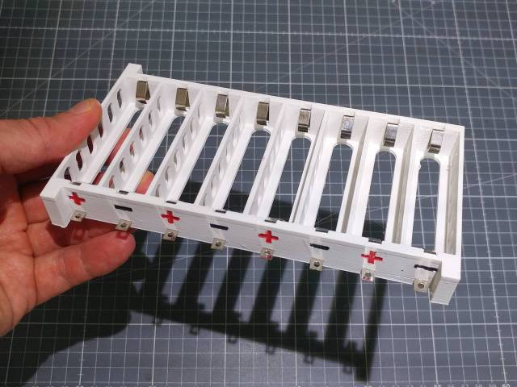
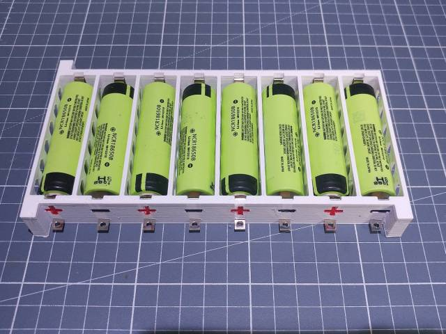

# 18650_battery_holder_high_current
Un support de batteries 18650 paramétrable, de ma conception, adapté à des courants relativement élevés.

Le design est également disponible sur Thingiverse : https://www.thingiverse.com/thing:6147387

Les contacts métalliques sont disponibles ici : https://fr.aliexpress.com/item/32946601230.html

Comme les batteries peuvent devenir assez chaudes et que le PLA n'est pas très résistant à la chaleur, il est préférable d'imprimer le boîtier en PETG, PET, ABS ou autre matériau résistant mieux à la chaleur que le PLA.

Comme on peut le voir sur quelques-unes des photos ci-dessous, je me suis fabriqué un boitier batteries pour mon vélo électrique, composé de 3 supports de batteries 18650 de 14 éléments chacun (soit 42 éléments en tout).

Le moteur qui équipe le vélo est un moteur Goldenmotor Magicpie de 1 kilo-watt, et malgré la puissance relativement élevée, ça marche super bien ! Environ 45 km/h sur du plat sans pédaler

# Captures d'écran

